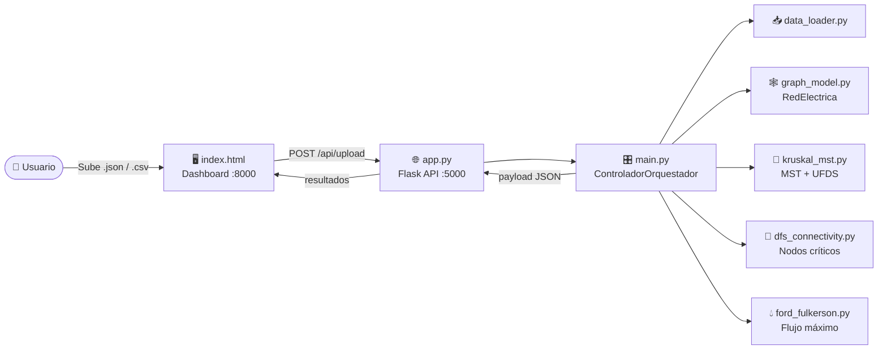

<div align="center">

# ⚡ Diseño y Análisis de Redes Eléctricas
### Optimización de costos, capacidad y resiliencia mediante Complejidad Algorítmica

**Caso de Estudio 8 · Diseño de redes eléctricas (IEEE)**
Curso **1ACC0184 – Complejidad Algorítmica** · Ciencias de la Computación · Ciclo **2026-20**


</div>

---

## 📑 Tabla de contenidos

1. [Resumen](#-resumen)
2. [Descripción del problema](#-descripción-del-problema)
3. [Modelado como grafo](#-modelado-como-grafo)
4. [Dataset](#-dataset)
5. [Propuesta: técnicas y metodología](#-propuesta-técnicas-y-metodología)
6. [Análisis de complejidad](#-análisis-de-complejidad)
7. [Arquitectura del aplicativo](#-arquitectura-del-aplicativo)
8. [Estructura del repositorio](#-estructura-del-repositorio)
9. [Instalación y ejecución](#-instalación-y-ejecución)
10. [API REST](#-api-rest)
11. [Validación de resultados y pruebas](#-validación-de-resultados-y-pruebas)
12. [Limitaciones y trabajo futuro](#-limitaciones-y-trabajo-futuro)
13. [Cumplimiento de requisitos del curso](#-cumplimiento-de-requisitos-del-curso)
14. [Declaración de uso de IA](#-declaración-de-uso-de-ia)
15. [Equipo](#-equipo)
16. [Referencias](#-referencias)

---

## 🧭 Resumen

Este proyecto modela una **red de transmisión eléctrica** como un grafo (subestaciones = nodos, líneas de transmisión = aristas) y aplica tres algoritmos clásicos para responder preguntas clave de ingeniería de redes:

| Pregunta de ingeniería | Técnica | Resultado |
|---|---|---|
| ¿Cuál es el **costo mínimo de cableado** que mantiene todas las subestaciones conectadas? | **MST – Kruskal** con **UFDS** | `costo_minimo_instalacion` |
| ¿Cuánta **energía puede soportar** la red entre dos puntos? | **Flujo máximo – Ford-Fulkerson** (búsqueda de caminos por BFS) | `flujo_maximo_red` |
| ¿Qué subestaciones son **puntos únicos de falla**? | **DFS – Puntos de articulación** (Tarjan) | `nodos_criticos` |

El sistema incluye una **API REST en Flask** y un **panel de control web (GUI)** donde se sube el dataset (`.json` o `.csv`) y se visualizan los resultados consolidados junto con el tiempo de ejecución algorítmica.

---

## 🎯 Descripción del problema

Las redes eléctricas son infraestructura crítica: un diseño deficiente eleva los costos de instalación, limita la capacidad de suministro y deja a zonas enteras sin energía ante la falla de una sola subestación.

El caso de estudio plantea diseñar una red eléctrica que:

- **Minimice el costo de cableado**.
- **Soporte la demanda energética** (capacidad de transporte).
- **Sea robusta ante fallos** (identificación de nodos cuya caída desconecta la red).

### Objetivos

**Objetivo general:** desarrollar un aplicativo que, a partir de datos reales de una red eléctrica representada como grafo, calcule indicadores de costo, capacidad y vulnerabilidad aplicando técnicas de Complejidad Algorítmica.

**Objetivos específicos:**

1. Representar una red de ≥ 1500 subestaciones y sus líneas de transmisión como un grafo.
2. Obtener la red de menor costo de instalación mediante un Árbol de Expansión Mínima (Kruskal).
3. Calcular la capacidad máxima de transporte entre un nodo origen y un nodo destino (Ford-Fulkerson).
4. Detectar subestaciones críticas mediante DFS (puntos de articulación).
5. Exponer los resultados mediante una API REST y una interfaz gráfica.

---

## 🕸️ Modelado como grafo

| Elemento del dominio | Elemento del grafo | Atributos |
|---|---|---|
| Subestación eléctrica | Nodo (vértice) | `id`, `latitud`, `longitud`, `tipo` |
| Línea de transmisión | Arista | `origen`, `destino`, `capacidad`, `costo` |
| Costo de la línea | Peso de la arista | `costo = distancia_m × precio_por_metro` |
| Capacidad de la línea | Capacidad de la arista | `capacidad` (por defecto **20.0 MW**) |

El grafo se almacena con **listas de adyacencia** (`RedElectrica.adyacencia`), lo que permite recorridos en `O(V + E)`.

---

## 📊 Dataset

> ⚠️ **Completar antes de entregar** (criterio de rúbrica II: estructura **y origen** del dataset).

- **Origen de los datos:** `[Indicar fuente: entidad, portal de datos abiertos, repositorio, fecha de consulta y enlace]`
- **Método de obtención:** `[Descargado / scraping / API / generado a partir de datos reales — explicar cómo]`
- **Tamaño:** `[N] nodos` y `[M] aristas` (mínimo exigido: **1500 nodos**, 500 por integrante).
- **Validación automática:** `data_loader.py` **rechaza** cualquier dataset con menos de 1500 nodos lanzando `DatasetValidationError`.

### Formato JSON principal (`dataset.json`)

```json
{
  "precios": [
    { "precio_por_metro": 3.98 }
  ],
  "conexiones": [
    { "origen": "N-1", "destino": "N-2", "distancia_m": 1250.5 },
    { "origen": "N-2", "destino": "N-3", "distancia_m": 980.0 }
  ]
}
```

- Los nodos se **deducen** de las conexiones (`origen` y `destino`).
- `costo = distancia_m × precio_por_metro` (valor por defecto **3.98** si no hay `precios`).
- `capacidad` toma el valor por defecto **20.0**.

### Formato JSON genérico (lista)

Nodos: `[{ "id": "N-1", "latitud": -12.05, "longitud": -77.04, "tipo_instalacion": "subestacion" }, ...]`
Aristas: `[{ "origen": "N-1", "destino": "N-2", "capacidad": 20, "costo": 4975.0 }, ...]`

### Formato CSV

| Entidad | Columnas requeridas |
|---|---|
| Nodos | `id, latitud, longitud, tipo_instalacion` |
| Aristas | `origen, destino, capacidad, costo` |

### Visualización del grafo (Hito 1)

`[Insertar aquí imagen del grafo completo y/o subgrafos — p. ej. generada con NetworkX/Gephi]`

```md

```

---

## 🧪 Propuesta: técnicas y metodología

### 1. Árbol de Expansión Mínima — Kruskal + UFDS (`kruskal_mst.py`)

Ordena las aristas por costo y agrega cada una **solo si no forma ciclo**, verificándolo con una estructura **Union-Find** optimizada con **compresión de caminos** y **unión por rango**. Es la técnica principal indicada para este caso de estudio.

**Por qué:** minimizar el cableado total que mantiene conectada la red es exactamente el problema del MST.

### 2. Flujo máximo — Ford-Fulkerson con BFS (`ford_fulkerson.py`)

Construye un **grafo residual** y busca repetidamente **caminos aumentantes** con BFS (variante Edmonds-Karp), actualizando capacidades residuales hasta que no existan más caminos.

**Por qué:** la capacidad de transporte entre dos puntos de la red equivale al flujo máximo (teorema max-flow min-cut).

### 3. Nodos críticos — DFS / Puntos de articulación (`dfs_connectivity.py`)

Recorrido DFS con tiempos de descubrimiento y valores `low` (algoritmo de Tarjan) para hallar subestaciones cuya falla **desconecta** secciones de la red.

**Por qué:** los puntos de articulación son los puntos únicos de falla; identificarlos permite planificar redundancia.

### Flujo de ejecución

1. **Carga y validación** del dataset (≥ 1500 nodos).
2. **Construcción** del grafo (listas de adyacencia).
3. **Kruskal** → MST y costo mínimo.
4. **DFS** → nodos críticos.
5. **Ford-Fulkerson** → flujo máximo entre `N-1` (o el primer nodo) y el último nodo del dataset.
6. **Consolidación** del *payload* JSON (contrato de datos) con el tiempo total de ejecución.

---

## ⏱️ Análisis de complejidad

Sea **V** el número de nodos y **E** el de aristas.

| Componente | Tiempo | Espacio | Notas |
|---|---|---|---|
| Carga y construcción del grafo | `O(V + E)` | `O(V + E)` | Listas de adyacencia |
| Kruskal + UFDS | `O(E log E)` | `O(V + E)` | Dominado por el ordenamiento; `find`/`union` ≈ `O(α(V))` amortizado |
| DFS – puntos de articulación | `O(V + E)` | `O(V)` | Recursión de profundidad hasta `V` |
| Ford-Fulkerson con BFS (Edmonds-Karp) | `O(V · E²)` | `O(V + E)` | Cota independiente de la capacidad |
| **Pipeline completo** | **`O(V · E²)`** | `O(V + E)` | Dominado por el flujo máximo |

---

## 🏗️ Arquitectura del aplicativo



**Patrón aplicado:** separación en capas — *presentación* (`index.html`), *servicio* (`app.py`), *orquestación* (`main.py`), *dominio/modelo* (`graph_model.py`) y *algoritmos* (módulos independientes). Cada algoritmo es un módulo desacoplado y reemplazable.

---

## 📁 Estructura del repositorio

```text
.
├── app.py                # API REST (Flask + CORS)
├── main.py               # ControladorOrquestador: coordina el flujo completo
├── data_loader.py        # Lectura y validación de datasets (JSON/CSV)
├── graph_model.py        # Clase RedElectrica (listas de adyacencia)
├── kruskal_mst.py        # Kruskal + UnionFind (UFDS)
├── ford_fulkerson.py     # Flujo máximo (BFS sobre grafo residual)
├── dfs_connectivity.py   # Puntos de articulación (Tarjan)
├── index.html            # Dashboard (GUI)
├── iniciar.bat           # Lanzador para Windows
├── dataset/              # Datos de entrada
└── README.md
```

---

## 🚀 Instalación y ejecución

### Requisitos

- Python **3.10+**
- Navegador web moderno

### 1. Clonar e instalar dependencias

```bash
git clone <URL_DEL_REPOSITORIO>
cd <NOMBRE_DEL_REPOSITORIO>

python -m venv venv
# Windows
venv\Scripts\activate
# Linux / macOS
source venv/bin/activate

pip install flask flask-cors
```

### 2. Ejecutar

**Opción A – Windows (un clic):**

```bat
iniciar.bat
```

Levanta la API en `http://localhost:5000`, sirve la interfaz en `http://localhost:8000` y abre el navegador automáticamente.

**Opción B – Manual (cualquier sistema):**

```bash
# Terminal 1 – API
python app.py

# Terminal 2 – Interfaz
python -m http.server 8000
```

Abrir **http://localhost:8000**, seleccionar el dataset y presionar **Procesar Red Eléctrica**.

### 3. Ejecución por consola (sin GUI)

Editar la ruta al final de `main.py` y ejecutar:

```bash
python main.py
```

Imprime el contrato de datos en formato JSON.

---

## 🔌 API REST

**Base URL:** `http://localhost:5000/api`

| Método | Endpoint | Descripción |
|---|---|---|
| `POST` | `/upload` | Recibe `file` (`.json` / `.csv`), ejecuta todos los algoritmos y devuelve el resultado consolidado |
| `GET` | `/network-status` | Nodos críticos y metadatos de la última red procesada |
| `GET` | `/optimization/mst` | Costo mínimo de instalación |
| `GET` | `/optimization/flow` | Flujo máximo, origen y destino evaluados |

### Ejemplo

```bash
curl -X POST -F "file=@dataset.json" http://localhost:5000/api/upload
```

### Contrato de datos (respuesta)

```json
{
  "mensaje": "Red procesada con éxito",
  "datos": {
    "costo_minimo_instalacion": 1234567.89,
    "flujo_maximo_red": 40.0,
    "nodos_criticos": ["N-12", "N-87"],
    "tiempo_ejecucion": 0.4321,
    "metadata": {
      "total_nodos": 1500,
      "total_aristas": 3200,
      "origen_flujo": "N-1",
      "destino_flujo": "N-1500"
    }
  }
}
```

> Los valores son ilustrativos. Reemplazar por los obtenidos con su dataset real.

### Códigos de error

| Código | Causa |
|---|---|
| `400` | Archivo ausente, vacío o con formato no soportado |
| `500` | Error en algoritmos (p. ej. dataset con < 1500 nodos) o datos aún no procesados |

---

## ✅ Validación de resultados y pruebas

> Completar con los resultados reales del proyecto.

### Entradas y salidas

| Entrada | Salida |
|---|---|
| `dataset.json` con `[N]` nodos y `[M]` aristas | Costo mínimo, flujo máximo, lista de nodos críticos, tiempo de ejecución |

### Casos de prueba sugeridos

| # | Caso | Resultado esperado |
|---|---|---|
| 1 | Dataset con < 1500 nodos | Error `DatasetValidationError` (HTTP 500) |
| 2 | Archivo con extensión no soportada (`.txt`) | HTTP 400 |
| 3 | Petición sin archivo | HTTP 400 |
| 4 | Grafo pequeño en forma de cadena (`A–B–C`) | `B` aparece como nodo crítico |
| 5 | Grafo en anillo | Sin nodos críticos |
| 6 | Red con 2 caminos disjuntos de capacidad 20 entre origen y destino | Flujo máximo = 40 |
| 7 | Triángulo con costos 1, 2, 3 | MST con costo 3 (aristas de costo 1 y 2) |
| 8 | Dataset real completo | Resultados coherentes y tiempo reportado en el dashboard |

### Resultados obtenidos

| Métrica | Valor |
|---|---|
| Nodos / Aristas | `[ ]` / `[ ]` |
| Costo mínimo de instalación | `[ ]` |
| Flujo máximo (origen → destino) | `[ ]` MW |
| Nodos críticos | `[ ]` |
| Tiempo de ejecución | `[ ]` s |

`[Insertar captura del dashboard: docs/img/dashboard.png]`

---

## 🔭 Limitaciones y trabajo futuro

**Limitaciones conocidas**

- **Dirección de las aristas:** `graph_model.py` guarda las conexiones **dirigidas** (origen → destino). Los puntos de articulación de Tarjan están definidos para grafos **no dirigidos**; si las líneas son bidireccionales, conviene descomentar la arista inversa en `inicializar_red`. Esto también afecta el flujo máximo.
- **Recursión en DFS:** `dfs_connectivity.py` es recursivo; con redes grandes o profundas puede superar el límite de recursión de Python (~1000). Mitigación: `sys.setrecursionlimit(...)` o versión iterativa.
- **Formato CSV:** `cargar_nodos` y `cargar_aristas` esperan columnas distintas, por lo que nodos y aristas deben cargarse desde archivos con esquemas apropiados o unificar el formato.
- **Capacidad y coordenadas por defecto:** con `dataset.json` la capacidad es constante (20.0) y las coordenadas se inicializan en 0.0.
- **Estado global:** `resultados_globales` en `app.py` no es seguro para múltiples usuarios concurrentes.
- **Ruta fija:** `main.py` contiene una ruta local de ejemplo que debe ajustarse.

**Trabajo futuro**

- Visualización interactiva del grafo y del MST en el dashboard (Leaflet / D3.js).
- Selección de origen y destino del flujo desde la interfaz.
- Aristas bidireccionales y capacidades reales por línea.
- Versión iterativa de DFS y comparación de rendimiento con Prim.
- Análisis de redundancia: costo de agregar aristas para eliminar nodos críticos.
- Pruebas automatizadas (`pytest`) y análisis empírico del tiempo vs. tamaño de red.

---

## 📋 Cumplimiento de requisitos del curso

| Requisito | Estado |
|---|---|
| Problema real representable como grafo | ✅ Red eléctrica |
| ≥ 1500 nodos (500 por integrante) | ✅ Validado en `data_loader.py` |
| Técnicas aceptadas del curso | ✅ MST (Kruskal), UFDS, Flujo máximo (Ford-Fulkerson), Recorridos en grafos (BFS/DFS) |
| Implementación en Python | ✅ |
| Interfaz gráfica (GUI) | ✅ `index.html` |
| Visualización del grafo/subgrafos (Hito 1) | ⬜ Pendiente de insertar |
| Descripción y origen del dataset | ⬜ Completar sección [Dataset](#-dataset) |
| Video de exposición (12 min, 4 por integrante) | ⬜ `[enlace]` |

---

## 🤖 Declaración de uso de IA

Según el reglamento del curso, el grupo debe declarar el uso de herramientas de IA y en qué parte se empleó.

> `[Completar con honestidad: herramienta utilizada y partes del proyecto donde se usó, o indicar que no se utilizó IA.]`

---

## 👥 Equipo

| Integrante | Código | Aporte |
|---|---|---|
| `[Nombre Apellido]` | `[U2026XXXXX]` | `[≥ 500 nodos + módulo]` |
| `[Nombre Apellido]` | `[U2026XXXXX]` | `[≥ 500 nodos + módulo]` |
| `[Nombre Apellido]` | `[U2026XXXXX]` | `[≥ 500 nodos + módulo]` |

**Docente:** `[Nombre del profesor]` · **Sección:** `[XXXX]`

**Entregable:** `TB1_1ACC0184_2026-20_CodigoAlum_ApellidoAlum`

---

## 📚 Referencias

> Reemplazar / ampliar con las fuentes realmente consultadas (formato IEEE o APA). La rúbrica valora respaldar la elección de técnicas con bibliografía o estudios previos.

1. T. H. Cormen, C. E. Leiserson, R. L. Rivest y C. Stein, *Introduction to Algorithms*, 4.ª ed. MIT Press, 2022. (Kruskal, Union-Find, Ford-Fulkerson / Edmonds-Karp.)
2. R. E. Tarjan, "Depth-first search and linear graph algorithms," *SIAM Journal on Computing*, vol. 1, n.º 2, pp. 146–160, 1972.
3. J. B. Kruskal, "On the shortest spanning subtree of a graph and the traveling salesman problem," *Proc. American Mathematical Society*, vol. 7, n.º 1, pp. 48–50, 1956.
4. L. R. Ford y D. R. Fulkerson, "Maximal flow through a network," *Canadian Journal of Mathematics*, vol. 8, pp. 399–404, 1956.
5. `[Fuente del dataset]`
6. `[Artículos / estudios sobre optimización de redes eléctricas con MST y flujo en redes]`

---

<div align="center">

**Complejidad Algorítmica · 2026-20 · Ciencias de la Computación**

</div>
